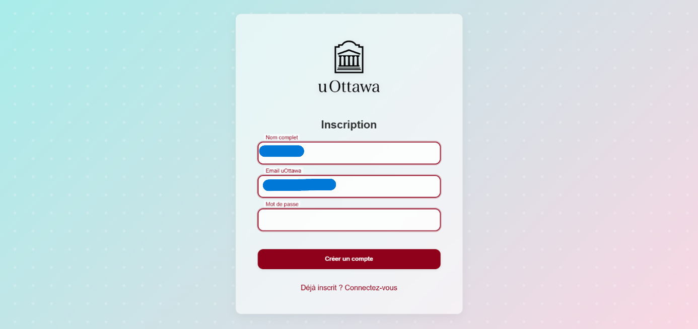
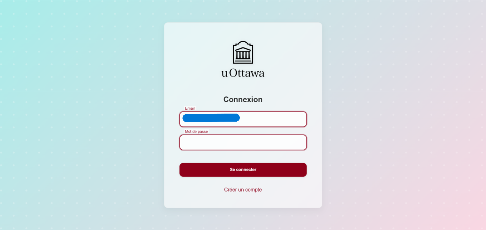
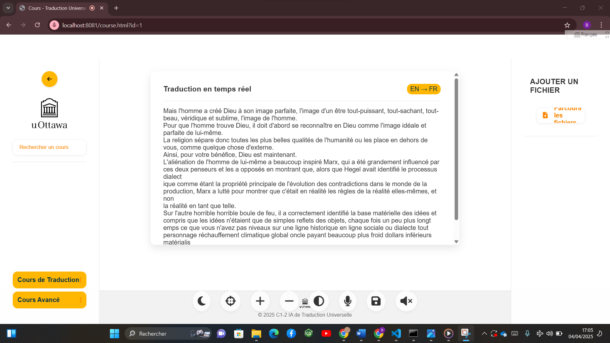

# 🌐 UoTranslate – Real-Time & Document Translator with Voice AI

> An open-source universal translator for students and teachers.  
> Translates live speech and documents in seconds. ✨


---

## 📖 Table of Contents

- [🎯 What is UoTranslate?](#-what-is-uotranslate)
- [🚀 Features](#-features)
- [🖥️ Screenshots](#%EF%B8%8F-screenshots)
- [📊 Tests & Results](#-tests--results)
- [📦 Tech Stack](#-tech-stack)
- [📽️ Demo Video](#-demo-video)
- [🤝 Contact](#-contact)

---

## 🎯 What is UoTranslate?

**UoTranslate** is a translation web app that:
- Translates your speech in real-time 🧠🗣️
- Converts audio or documents (PDF, DOCX, PPTX, WAV) into readable translations
- Speaks results using synthesized voice

Built for **students** facing language barriers and for **educators** teaching diverse classrooms.

---

## 🚀 Features

- 🎙️ Real-time speech transcription (Vosk)
- 🌍 Translation (MarianMT / Argos Translate)
- 🗣️ Text-to-Speech (WebSpeech + Silero)
- 📄 Document translation with Wave2Vec2
- 📡 Works offline & online
- 🔒 Secure & lightweight

---

## 🖥️ Screenshots

<p align="center">
  
  <br><em>🔐 User sign up screen</em>
</p>

<p align="center">
  
  <br><em>🔑 Secure login system</em>
</p>

<p align="center">
  
  <br><em>📡 Real-time translation via WebSocket</em>
</p>

<p align="center">
  
  <br><em>📄 Document translation (Karl Marx lecture)</em>
</p>

---

## 📊 Tests & Results

| Metric                         | Value          |
|--------------------------------|----------------|
| Real-Time Transcription (Vosk) | 91% Accuracy   |
| Document Transcription (W2V2)  | 100% Accuracy  |
| WebSocket latency              | < 200 ms       |
| Upload success rate            | 100% (all formats) |

---

## 📦 Tech Stack

| Layer              | Tool / Tech                   |
|--------------------|-------------------------------|
| Frontend           | HTML, CSS, JS, WebSocket      |
| Backend            | FastAPI                       |
| Transcription      | Vosk (real-time), Wave2Vec2   |
| Translation        | MarianMT, Argos Translate     |
| TTS                | WebSpeech API / Silero        |
| Database           | Firestore (Firebase)          |

---

## 📽️ Demo Video

🎬 [Click to watch full demo on YouTube](https://www.youtube.com/embed/h98JeLK8qnM?feature=oembed)

---

## 🤝 Contact

> Maintained by [Bineta Ly](https://www.linkedin.com/in/bineta-ly-2a3814221/)  
> For bugs, suggestions or collaboration, feel free to reach out!

---

## 📁 Project Structure

```bash
traducteur-universel/
│
├── app.py
├── routers/
│   ├── auth_router.py
│   ├── courses_router.py
│   └── ...
├── utils/
│   ├── transcription.py
│   ├── translation.py
│   └── tts.py
├── tradapp.py  # Document translation (Wave2Vec2)
├── public/
│   ├── index.html
│   ├── script.js
│   └── style.css
└── screenshots/
    ├── inscription.PNG
    ├── login.png
    └── ...
```

---

## 🧠 Fun Fact

> This app can present itself during your pitch… using its own TTS engine 🤯